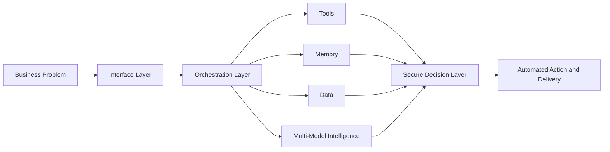

<!-- ================================================= -->
<!-- HERO HEADER -->
<!-- ================================================= -->

  

  
  
  

---

  <a href="#mission-control">Mission Control</a> |
  <a href="#mission-radar">Mission Radar</a> |
  <a href="#brand-credentials">Brand Credentials</a> |
  <a href="#project-atlas">Project Atlas</a> |
  <a href="#featured-projects">Featured Projects</a> |
  <a href="#execution-blueprint">Execution Blueprint</a> |
  <a href="#ai-and-sons-crest">AI and Sons Crest</a> |
  <a href="#currently-building">Currently Building</a> |
  <a href="#connect">Connect</a>

---

## Welcome

I build **AI-driven systems, automation platforms, and secure enterprise tooling**.

My work sits at the intersection of:

- Artificial Intelligence Engineering
- Automation and Agentic Systems
- Enterprise Identity Architecture
- Security Engineering
- Developer Productivity Platforms

Professionally I work in **Information Security and Identity Architecture** while building advanced AI platforms through **AI and Sons**.

---

## Mission Control

  
  
  

  
  
  

I build and run automation like production infrastructure, with observable pipelines, repeatable systems, and secure-by-default controls.

---

  

---

  

---

## What Sets Me Apart

- I bridge **AI engineering and enterprise security** in the same execution model.
- I ship systems that move from prototype to production with governance in place.
- I design for operators first, so tools are usable under real-world pressure.
- I optimize for leverage: less manual work, faster delivery, stronger controls.

---

## Core Focus

---

## Technology Stack

### AI Ecosystem

### Development

### Identity and Security

---

---

## GitHub Metrics

---

## Contribution Activity Graph

---

## 3D Contribution Skyline

---

  

---

## Featured Projects

### [Doc2URL](https://github.com/LEnc95/Doc2URL)
Turns source documents into shareable, operational URLs for faster internal delivery.

### [games.aiandsons.io](https://github.com/LEnc95/games.aiandsons.io)
Interactive sandbox for experimentation with AI interaction loops, UX, and rapid iteration.

### [MFAAutomation](https://github.com/LEnc95/MFAAutomation)
Enterprise MFA and identity-operations automation focused on reliability and policy alignment.

### [OCR](https://github.com/LEnc95/OCR)
Extracts actionable data from unstructured documents for downstream automation workflows.

---

## Architecture Philosophy

> **Build systems that build systems.**

Automation creates leverage.

Artificial intelligence multiplies that leverage.

Secure infrastructure allows the leverage to scale safely.

---

  

---

## Execution Blueprint

### How I Build

I design systems that route real-world problems through **interfaces, orchestration, memory, tools, and multi-model intelligence** so the output is not just insight, it is action.

That means building platforms that can:

- understand context
- call tools safely
- reason across steps
- automate execution
- stay secure in enterprise environments

---

## Currently Building

  
  
  

- AI systems that coordinate tools, memory, and reasoning
- security-first automation for enterprise identity workflows
- practical AI products through **AI and Sons**
- internal tooling that removes repetitive work and accelerates delivery

---

## Engineering Principles

<table>
  <tr>
    <td><b>Security First</b></td>
    <td>Every useful system should be designed to scale safely.</td>
  </tr>
  <tr>
    <td><b>Automation by Default</b></td>
    <td>If a task repeats, it should be systematized.</td>
  </tr>
  <tr>
    <td><b>AI Where It Matters</b></td>
    <td>I use AI where it creates real operational leverage, not just novelty.</td>
  </tr>
  <tr>
    <td><b>Build for Operators</b></td>
    <td>The best tooling reduces friction for real people doing real work.</td>
  </tr>
</table>

---

## Founder

### AI and Sons

AI consulting and engineering studio focused on practical AI systems.

Areas of work:

- AI workflow automation
- enterprise AI integrations
- developer copilots
- automation infrastructure
- intelligent software systems

---

## Build With Me

I partner on high-leverage projects where security, automation, and AI must work together from day one.

- Enterprise AI implementation with governance
- Identity and access automation architecture
- AI-powered internal platforms for operator teams
- Security-first workflow modernization

---

  

---

## Connect

---

<b>AI Engineer | Security Architect | Founder | Builder</b>

